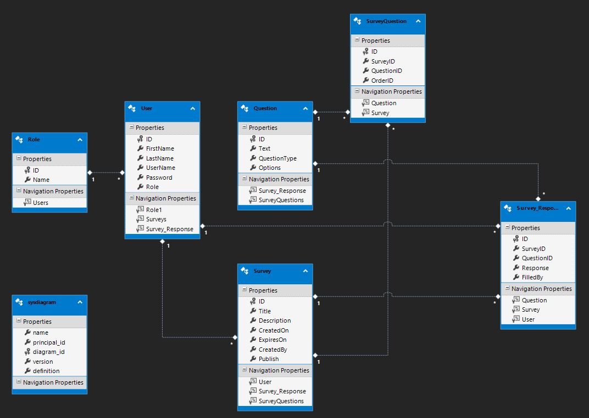
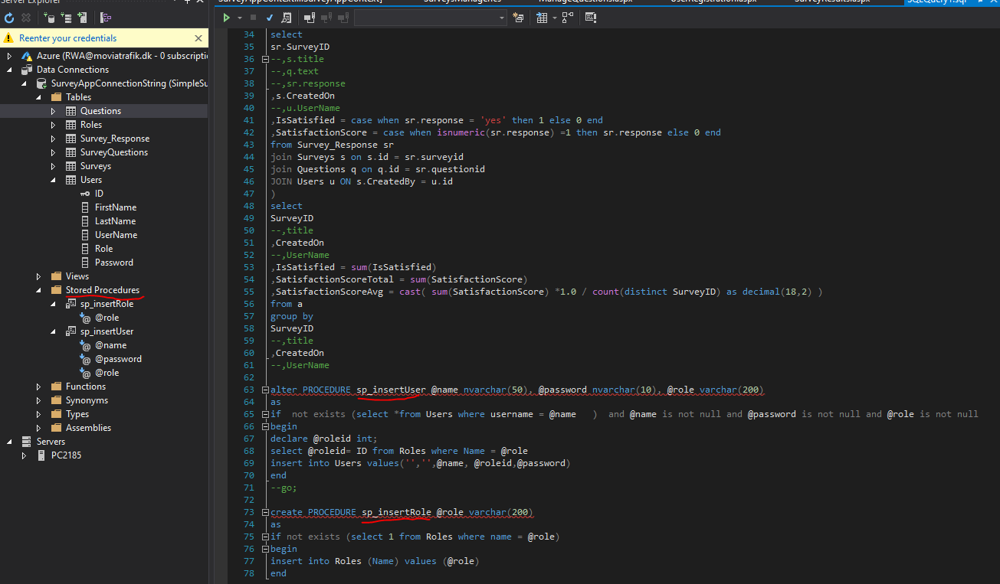

# SurveyWebApp
 - This App supports flexibly creating survey questions, collecting survey response, all saved to sql database. 
 - In order to execute this program, one has to install [MS SQL Server](https://www.microsoft.com/en-us/sql-server/sql-server-downloads) and run the sql script file ``` "CreateDatabaseTables.sql"``` to create database and tables. 
 - Date Model
    
 - Stored procedure
  
 
